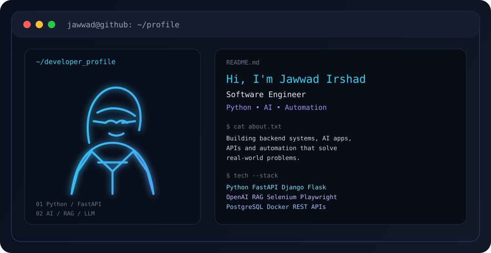

<div align="center">



<br/>

<a href="https://github.com/JawwadIrshad">

</a>
<a href="https://www.linkedin.com/in/jawwadirshad/">

</a>
<a href="https://jawwadirshad.netlify.app">

</a>

</div>

<br/>

## `$ whoami`

> Software Engineer focused on **Python backend development, AI-powered applications, API integration, and automation**.

I build practical systems that connect APIs, process data, automate workflows, and use modern AI/LLM technologies to solve real-world problems.

```python
class Jawwad:
    role = "Software Engineer"
    focus = ["Python", "AI", "Backend", "Automation"]
    building = ["APIs", "AI Applications", "RAG Systems", "Automation"]
    open_to = ["Remote", "Freelance", "Relocation"]
```

---

## `$ ls ./skills`

| Area | Technologies |
|---|---|
| **Backend** | Python, FastAPI, Django REST Framework, Flask, REST APIs |
| **AI / LLM** | OpenAI API, LangChain, RAG, Embeddings, Vector Databases |
| **Automation** | Selenium, Playwright, BeautifulSoup, Pandas |
| **Testing** | Postman, API Testing, Functional Testing, Test Automation |
| **Databases** | PostgreSQL, MySQL, SQLite |
| **DevOps / Tools** | Docker, Git, GitHub |
| **Web** | JavaScript, React, HTML, CSS |
| **Commerce** | WooCommerce, API Integrations |

---

## `$ ./projects --featured`

### `01` — CareCloud | Voice AI Patient Registration

A voice-based patient intake system that collects patient information through natural conversation, validates the data, and stores it through a backend API.

**Python · FastAPI · PostgreSQL · Vapi · OpenAI**

[View Repository](https://github.com/JawwadIrshad/carecloud-patient-registration) · [Live API](https://carecloud-patient-registration-production.up.railway.app) · [Swagger Docs](https://carecloud-patient-registration-production.up.railway.app/docs)

### `02` — AI-Powered RAG Chatbot

A retrieval-augmented AI application designed to combine application-specific knowledge with LLM-powered responses.

**Python · FastAPI · RAG · LLM Integration**

### `03` — Restaurant Management System

A full-stack restaurant management application with a React frontend, Flask backend, REST APIs, and PostgreSQL database.

**React · Flask · PostgreSQL · REST API**

### `04` — WooCommerce Automation

Python-based product data processing and browser/API automation solutions for WooCommerce stores.

**Python · Selenium · Playwright · WooCommerce**

---

## `$ git log --oneline`

```text
backend  →  APIs  →  automation  →  AI  →  better software

Build it.
Automate it.
Make it intelligent.
Ship it.
```

---

## `$ github --stats`

<div align="center">


<br/><br/>


</div>

---

## `$ connect`

```text
Email      →  jawwadirshad19@gmail.com
LinkedIn   →  linkedin.com/in/jawwadirshad
GitHub     →  github.com/JawwadIrshad
Portfolio  →  jawwadirshad.netlify.app
```

<div align="center">

### `Thanks for visiting my profile.`

**If you find something useful here, feel free to ⭐ a repository.**

</div>
